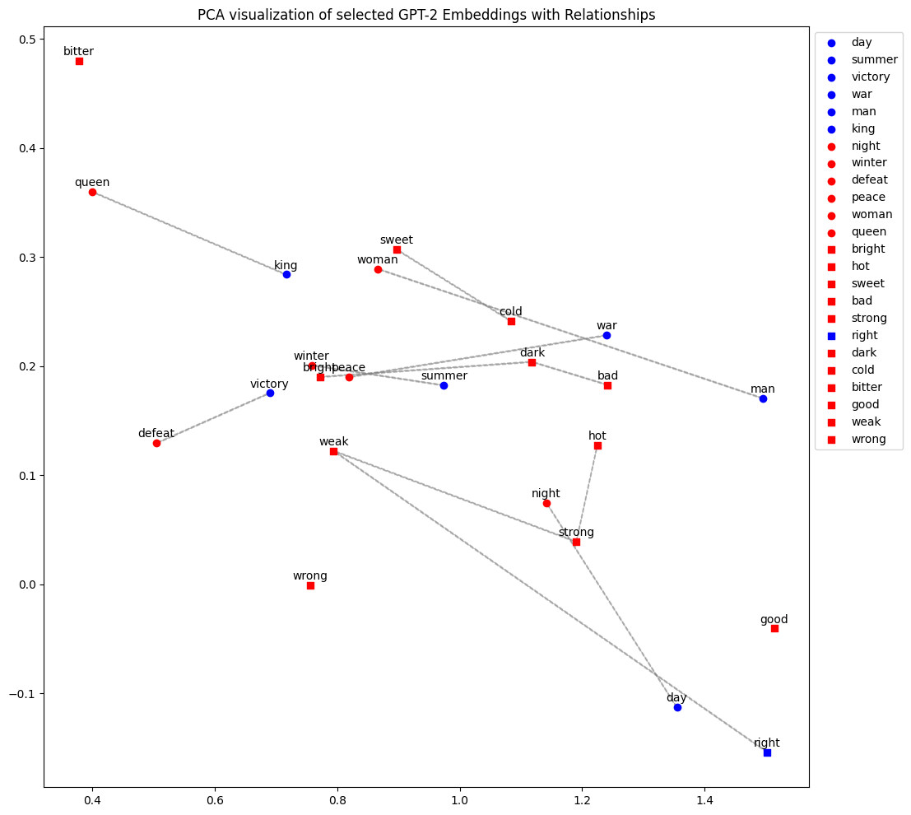
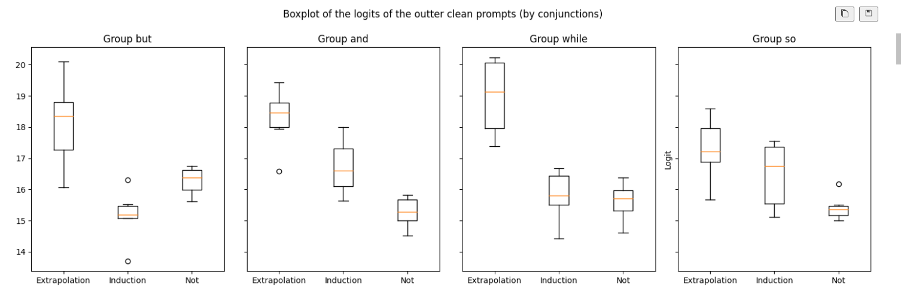
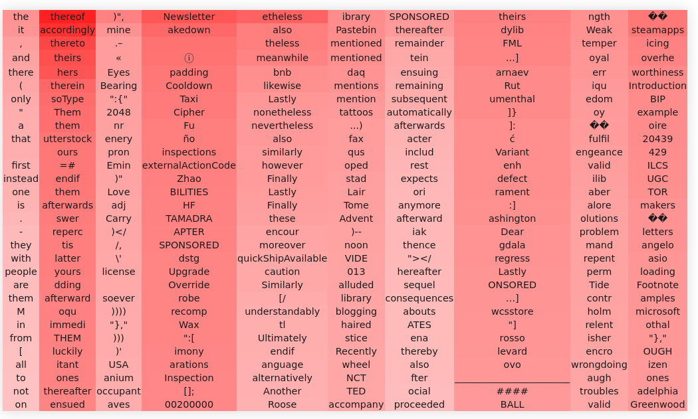

## Balanced Sentence in GPT-2 Part 1

GPT-2 is one of the most widely studied LLM models in the field of mechanistic interpretability. This is due to its lower parameter count, which makes it cost-effective for running experiments, as well as its pioneering role in the field.

Various important papers and blog posts have been published investigating this model in the context of mechanistic interpretability. The most significant ones are the following: (find citations)
- Interpretability in the Wild
- In-Context Learning and Induction
- A vs. An Neuron
- Gender in GPT
- Parentheses in GPT-2

This work can be divided into two distinct categories: general and narrow work.

For example, "Interpretability in the Wild" falls into the narrow work category due to the specific distribution in which the experiment takes place. This distribution consists of sentences (or prompts) like "Mary and John went to the store; Mary gave a bottle of milk to John."

This task is particularly well-chosen because all the information needed to perform it successfully is already in the sentence, eliminating the need for any "latent knowledge" to be extracted from the model.

In this post, I want to introduce a new task that, while not as refined as the IOI, can still be useful for understanding some of the inner workings of GPT-2.

### Sentence Balancing Task

The task we aim for our model to solve involves completing a type of analogy I call "Sentence Balancing."

Sentences take the form: "The day is bright; the night is `dark`."

Here, "dark" is the token the model must predict to "balance the sentence."

Several immediate questions arise, the most important of which is: how well does the model perform this task?

Unfortunately, the answer is: not that great.

There are various ways to measure performance on this task. Some tests have been conducted, revealing that when the sentence generally makes sense, the performance is almost perfect. However, the model's performance drops significantly when the adjectives and nouns are not related.

*This will be further explored later in the post.*

### Objectives of the Series of Posts
- Generate the dataset
- Evaluate how well the model performs the task in its various versions
- Conduct exploratory analyses to determine which components of the model are most important for this task
- Explore the embeddings and check the SVD
- Unembed directions
- Set up some patching experiments
- Use the ACDC software implementation
- Use input swap software implementation
- Analyze the computational graph of the task
- Find all the prompts where this behavior can be observed
- Neuroscope

### Things to Check
- Observe how the logits of inductions vs. extrapolations evolve through the model
- Explore MLP0 retokenization
- Examine head direct logit attribution
- Define a good metric
- Assess how much attention is paid to names and adjectives

### Generate the Dataset

A dataset was created, following a similar approach to the IOI paper, to study this task. The basic structure of the prompt is:

**The [noun1] is [adj1]; the [noun2] is [adj2]**

For example, [day],[bright],[night],[dark].

The dataset consists of quartets that follow certain rules:
- The nouns and adjectives must be single tokens (due to GPT-2 tokenizer limitations)
- There must be a strong semantic connection between the terms

### Examples

| Category  | Positive nouns | Negative nouns | Positive adjectives | Negative adjectives |
|------------|----------------|----------------|---------------------|---------------------|
|     1      | day            | night          | bright              | dark                |
|     2      | summer         | winter         | hot                 | cold                |
|     3      | victory        | defeat         | sweet               | bitter              |
|     4      | war            | peace          | bad                 | good                |
|     5      | man            | woman          | strong              | weak                |
|     6      | king           | queen          | good                | bad                 |





### Performance of GPT-2 in the Sentence Balancing Task

#### With Conjunctions

The performance of GPT-2-small in terms of output logits for **extrapolations**, **inductions**, and **ellipsis** is as follows:

Example of prompt with conjunction:
```
The day is bright, but the night is dark
```




#### Without Conjunctions

Example of prompt without conjunction:

```
The day is bright; the night is dark
```


It is clear from the graphs that the task is best accomplished when conjunctions are used in the prompt. This suggests that conjunctions like "but" might be trigger words for this kind of extrapolation behavior.

### Exploratory Analysis

Which components of the model contribute more to the final logits of the correct answer? One elegant and widely used way to visualize this is by tracking the logit differences accumulated through the layers.

#### Logit Differences Accumulated Through the Residual Stream

The performance increases noticeably around the 8th layer.


#### Layer Attribution


#### Head Attribution

The most important head appears to be head 9 in layer 7.


Using a technique outlined in the blog post  we can look up the SVD of the OV matrix in the attention head 79 in layer 7 to check which are the top tokens affected by the head.




We can observer a notable presence of conjunctions.

### Neuron Attribution


