# Word Embeddings: A Comprehensive Guide Part 1

## Table of Contents

- [Word Embeddings: A Comprehensive Guide Part 1](#word-embeddings-a-comprehensive-guide-part-1)
  - [Table of Contents](#table-of-contents)
  - [Introduction](#introduction)
    - [Definition](#definition)
    - [Usage](#usage)
  - [What are word embeddings?](#what-are-word-embeddings)
    - [Different word embeddings](#different-word-embeddings)
    - [Semantic similarity](#semantic-similarity)
  - [Clustering](#clustering)
    - [Clustering techniques](#clustering-techniques)
    - [Brief explanation of the technique family and it's interpretation when clustering word embeddings.](#brief-explanation-of-the-technique-family-and-its-interpretation-when-clustering-word-embeddings)
    - [Metrics for clusterbility](#metrics-for-clusterbility)
    - [Examples of interpetable clusters](#examples-of-interpetable-clusters)
  - [Distribution of word embeddings](#distribution-of-word-embeddings)
    - [How much do similar tokens share representations](#how-much-do-similar-tokens-share-representations)

---

## Introduction

### Definition

**Word embeddings** are mathematical representations of words, encapsulating their meanings, syntactic attributes, and contextual relations.

**Embedding space**
The embadding space is formed by a large collection of so called embedding vectors.

### Usage

Word embeddings are extensively used in various Natural Language Processing (NLP) tasks such as sentiment analysis, machine translation, and text summarization.

## What are word embeddings?

Word embeddings are often the result of training some language model on a corpus.
The main characteristics of an embedding space are:

- Their dimesionality:

This is the length of a single word embedding and can go from 50 vector entries in small models to the 1000s in the largest models.
Such a high dimesionality is key to encode certain relationships on embedding space as result of minimizing some loss function.

- The vocabulary space:

This is; the number of different vectors thtat define the embedding space.
Most of the time this number is set in advance when pretraining the model and is largley decided by the tokenizer.
The tokenizer is an algorithm that chunks the corpus in smaller units,in order to get a rich representation but with a limited number of possible tokens.

Usually the vocabulary is in the 10s of thousands of words.
Arounnd 50000 for the  GPT familty and 30000 for BERT.

### Different word embeddings

There exist differnt word embeddings due to several factors such as:
- Tokenizer
- Vocabulary size
- Embedding size
- Model structure
- Corpus pretrained on
- Random seeds
- etc

Some popular models that produce word embeddings are the following:
- One-Hot Encoding
- Word2Vec
- GloVe
- FastText
- BERT

### Semantic similarity

Work dating back to the 2010's showed that in some cases, embeddings could be operated in a straightworward  manner.
Such in the famous example of:

**king-man=queen-woman**

In the following years several algorithms and strategies where specially designed to find such semantic pairs, most of the time involving the computing of cosine similarity of embeedings to find the "closest" word that was token at.

## Clustering

Following past work done on clustering word emnbedding and given the fact that some ammount of semantic relations can be found between word embeddings, the question I want to ask is If we cluster the embedding space do some/any of the produced clusters encode semantic families?

To answer this question we will use BERT uncased trained on a general corpus in english, and several clustering techniques to try finding interpretable clusters.

### Clustering techniques

There exist a varity of clustering techniques, a straight-forward way of classifying clustering technques in based ont the nature of the algorithm.
The 3 main kinds of clusterin we are gonna use are:

- Hierarchical clustering
  - Agglomerative Clustering
- Partitioning methods
  - k-means
  - DBSCAN
- Graph Based
  - Louvain method

### Brief explanation of the technique family and it's interpretation when clustering word embeddings.

**Hierarchical Clustering**

This family of techniques build tree-like strucutres by conitnously dividing larger clusterd intro smaller oned.
The result is a dendrogram tha we can `cut` at any level, to get a certain number of clusters.

Applied on embedding space, hierarchical clustering might give us the oprtunity of observing semantic similarities at different levels of granularity.

**Partitioning Methods**

This familty of techniques divide the space into partitions, provided that we specify in advance the number of clusters we want.

In advance, partitioning methods seem the weaker of the technques given that we msut specify the number of clusters and that the centroid might not well capture the sematnic motif of the cluster.

**Graph-Based Methods**

In this technique family a grpah is costructed where the datapoints are the nodes, and the similarity between two datapoints is the weight of the edge that connecte the 2 nodes.
The process iteratively preserves or cuts some edges given the objective of findinf clusters or communites.

Graph based methods should be well suited for detecting intrincate relationships between embeddings.

### Metrics for clusterbility

- Silhouette score

Agglomerative

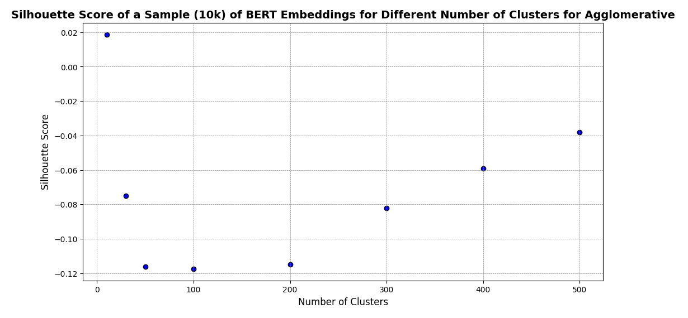

KMEANS

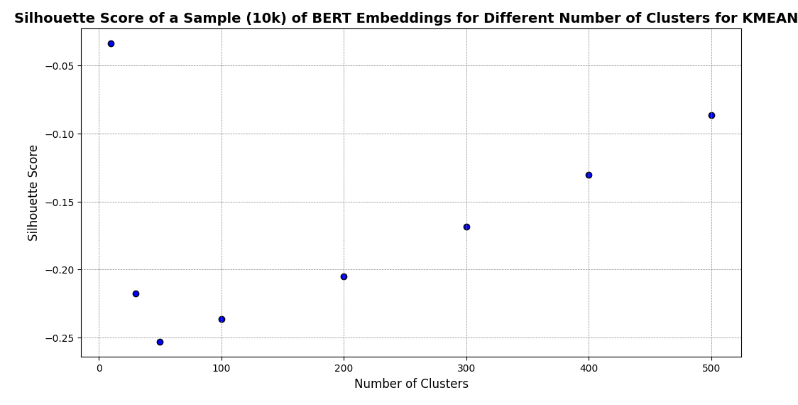

### Examples of interpetable clusters

**Agglomerative clustering  10 clusters**

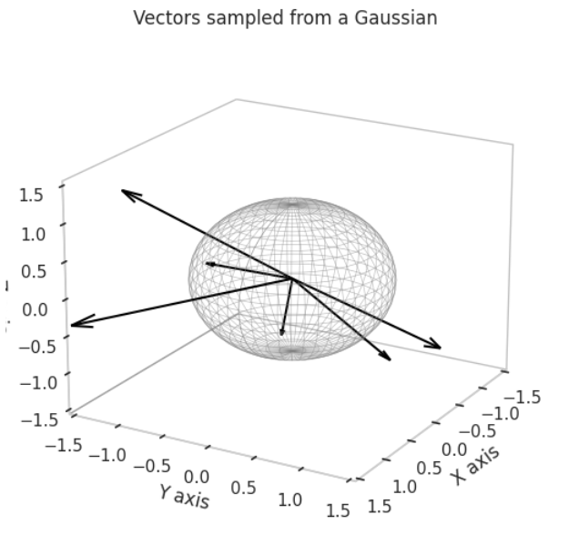

**Agglomerative clustering  100 clusters**

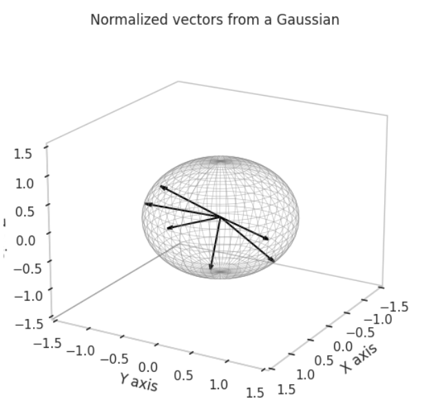

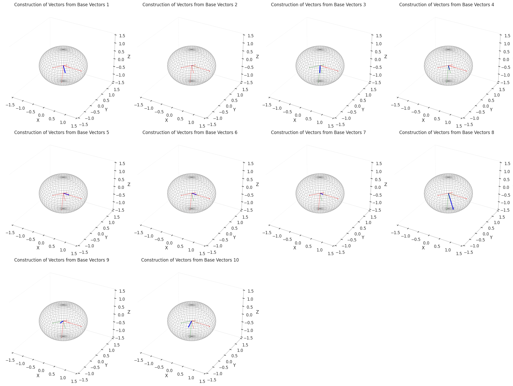

**k-means 100 clusters**  

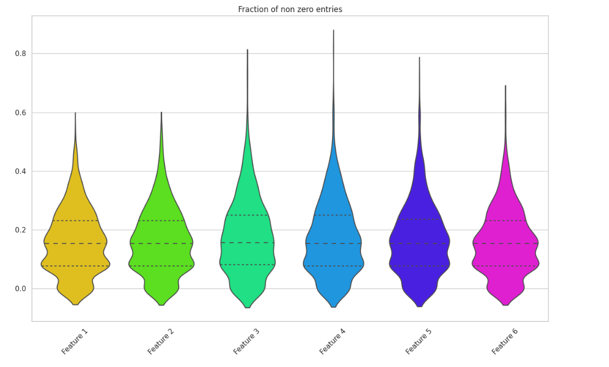

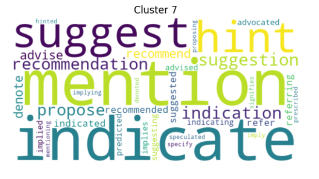

**Louvain threshold 0.5 resolution 0.2**

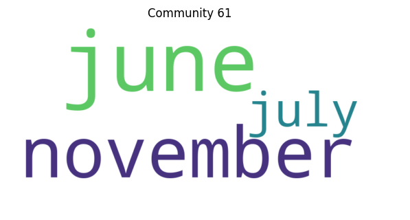

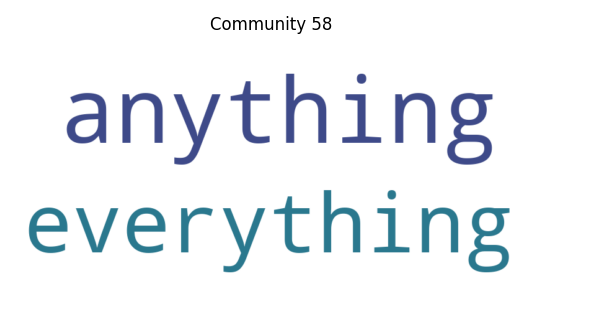

`The effectivness of the clustering is largley influenced by the threshold and the resolution`

**Empirical findings show that selecting the threshold and resolution scoring by:**

$$

\text{return} = \text{num\_communities} \times \frac{1}{N} \sum_{i=1}^{N} \text{node\_counts}_i
$$

## Distribution of word embeddings

In *An Isotropy Analysis in the Multilingual BERT Embedding Space* is shown that the embedding space has an anisotropic distribution.
Isotropy is measurec with the mean pairwise cosine similarity aswell as with the product of the fraction of the max PC over the minimum PC times the 

Specifically the anisotropic inducing behavior is concentred in a few components.

### How much do similar tokens share representations

- Drop the tokens that are too short
- Compute the pairwise cosine similarity
- Compute the pairwise minimum edit distance
- For each row group the tokens by minimum edit distance and average the cosine similarity by group to the reference token
- Histogram of the means by minimum eddit distance

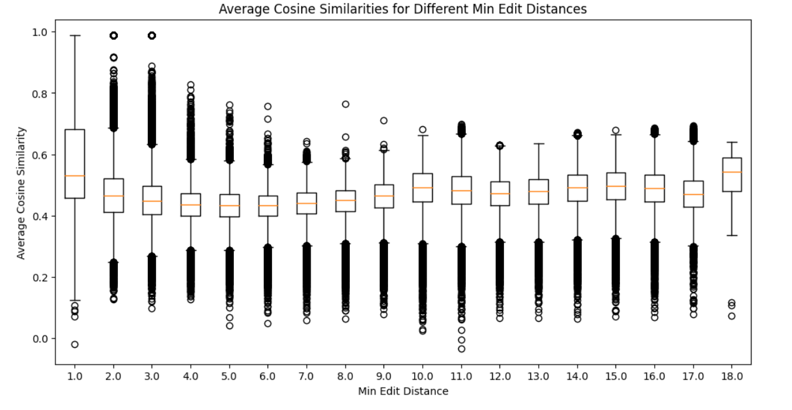

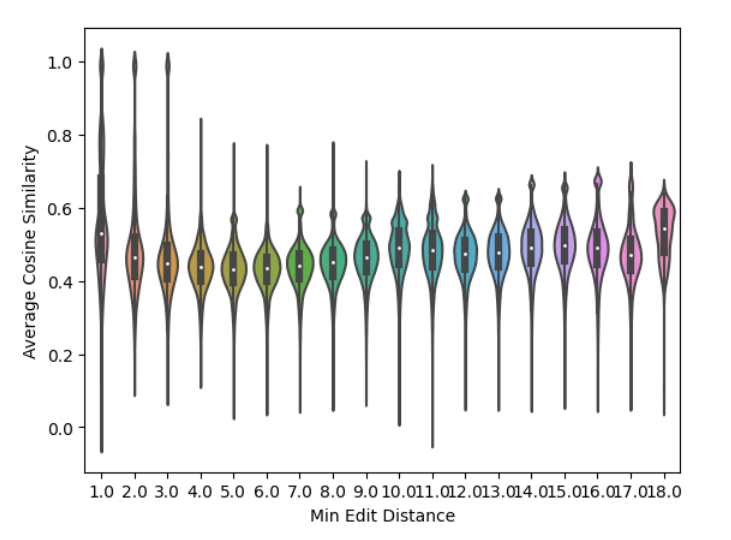

If we look at the first 3 minimum edit distance we can observe that some tokens have a very high cosine similarity.
This is largly due to plurals, gender cased, etc

